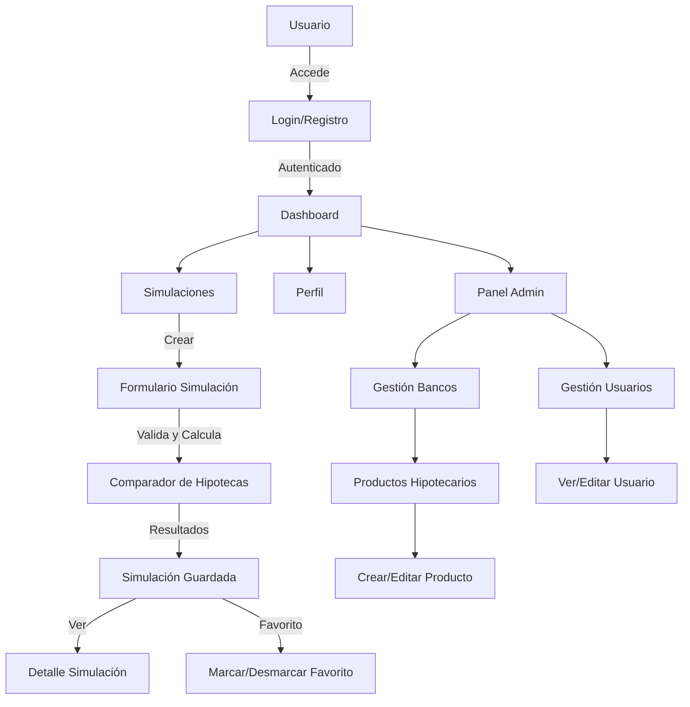
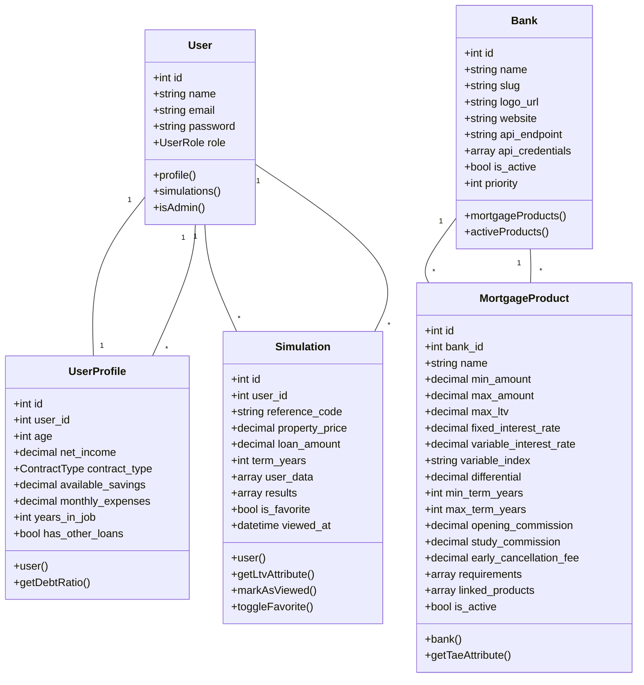

# Documentación Detallada: Mortgage Comparator

Bienvenido/a al proyecto Mortgage Comparator. Esta documentación está pensada para que cualquier persona nueva pueda entender, mantener y evolucionar el sistema de forma sencilla.

## Índice
- [Resumen del Proyecto](#resumen-del-proyecto)
- [Estructura del Proyecto](estructura.md)
- [Endpoints y Rutas](endpoints.md)
- [Lógica de Simulación](logica_simulacion.md)
- [Roles y Seguridad](roles_y_seguridad.md)
- [Testing y Buenas Prácticas](testing.md)
- [FAQ y Consejos](faq.md)

---

## Resumen del Proyecto

Mortgage Comparator es una aplicación web desarrollada en Laravel que permite a los usuarios comparar productos hipotecarios de diferentes bancos, realizar simulaciones personalizadas y gestionar su perfil financiero. Incluye un panel de administración para la gestión de bancos, productos y usuarios.

### Diagrama de Flujo de Usuario

### Diagrama de Clases (Modelo de Datos)

---

Para cualquier duda, consulta los archivos temáticos en la carpeta `docs/`.