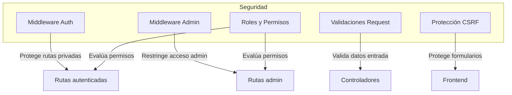

# Roles y Seguridad

Este documento explica cómo se gestionan los roles de usuario y la seguridad en el proyecto Mortgage Comparator.

## Roles
- **Usuario (user):** Puede simular hipotecas, gestionar su perfil y ver su histórico de simulaciones.
- **Administrador (admin):** Acceso completo al panel de administración, gestión de bancos, productos y usuarios.

Los roles se definen en el enum `App\Enums\UserRole` y se almacenan en el campo `role` de la tabla `users`.

## Middleware
- `auth`: Protege rutas que requieren usuario autenticado.
- `admin`: Restringe rutas administrativas solo a usuarios con rol admin (ver `app/Http/Middleware/IsAdmin.php`).

## Validaciones y protección
- Todas las peticiones pasan por validaciones exhaustivas en los Form Requests.
- Protección CSRF en formularios.
- Los datos sensibles (contraseñas, tokens) están ocultos y/o encriptados.
- Los endpoints de administración están protegidos por middleware y comprobación de rol.

## Diagrama de Seguridad

## Consejos para desarrolladores
- Nunca expongas datos sensibles en las vistas o respuestas JSON.
- Usa siempre los métodos de validación y autorización de Laravel.
- Si añades nuevas rutas de administración, recuerda protegerlas con el middleware `admin`.